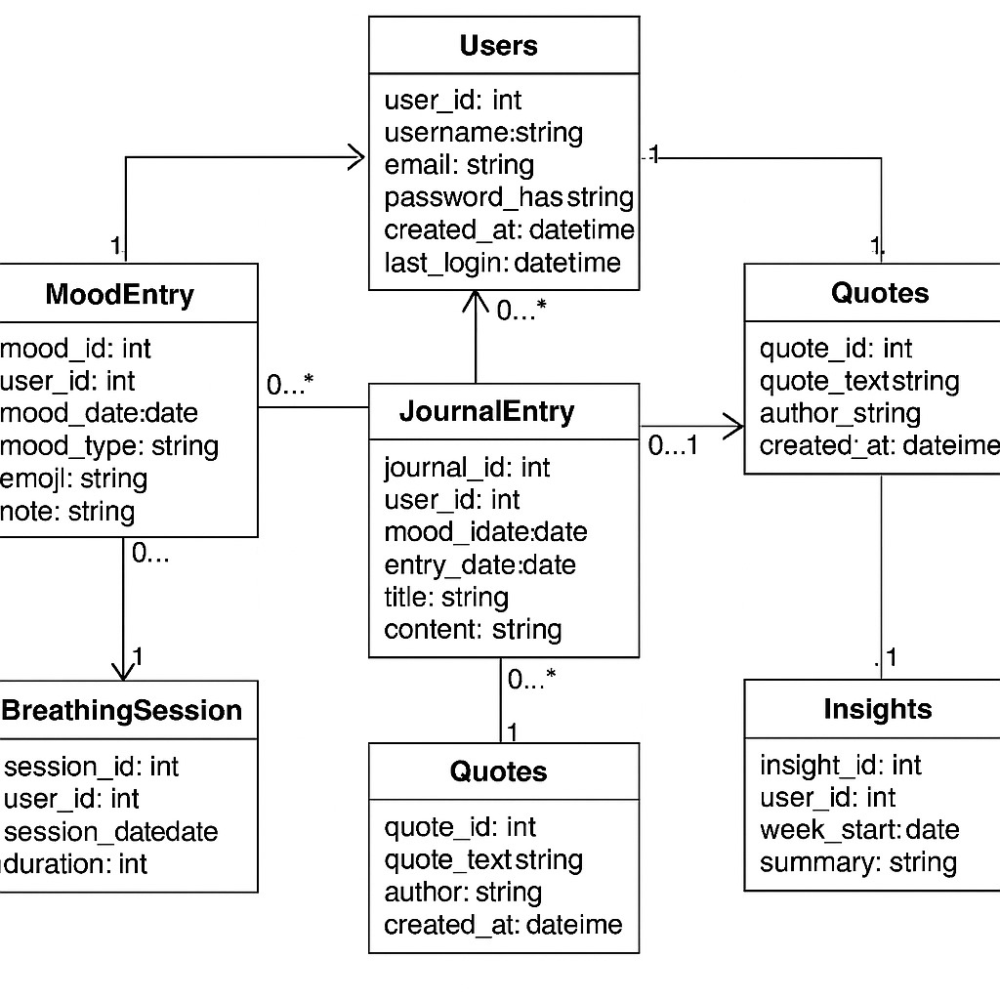

#  MindMate – Database Design (Part 2)

  
## 1. Entities and Attributes (Summaries)

### **Users**
Stores account information for each registered user.

| Attribute | Description |
|------------|--------------|
| `user_id` *(PK)* | Unique identifier |
| `username` | Display name (unique) |
| `email` | Login email (unique) |
| `password_hash` | Encrypted password |
| `created_at` | Account creation date |
| `last_login` | Last active date (for streak tracking) |

**Relationships:**  
One `User` → Many `MoodEntry`, `JournalEntry`, `BreathingSession`, `Insights`.

---

### **MoodEntry**
Tracks a user’s emotional log for the day.

| Attribute | Description |
|------------|--------------|
| `mood_id` *(PK)* | Unique mood record |
| `user_id` *(FK)* | References `Users(user_id)` |
| `mood_date` | Date of mood log |
| `mood_type` | Enum: `happy`, `neutral`, `sad`, `anxious`, `stressed` |
| `emoji` | Optional emoji representation |
| `note` | Optional reflection |

**Relationships:**  
Many `MoodEntry` records belong to one `User`.  
One `MoodEntry` may link to one or more `JournalEntry`.

---

### **JournalEntry**
Stores user reflections and notes.

| Attribute | Description |
|------------|--------------|
| `journal_id` *(PK)* | Unique journal ID |
| `user_id` *(FK)* | References `Users(user_id)` |
| `mood_id` *(FK)* | Optional reference to `MoodEntry(mood_id)` |
| `entry_date` | Date created |
| `title` | Optional title |
| `content` | Main journal text |

**Relationships:**  
Many `JournalEntry` records belong to one `User`.  
Optionally connected to a `MoodEntry`.

---

###  **Quotes**
Contains motivational quotes or wellness messages.

| Attribute | Description |
|------------|--------------|
| `quote_id` *(PK)* | Unique quote ID |
| `quote_text` | Quote text |
| `author` | Optional quote author |
| `created_at` | Timestamp added |

**Relationships:**  
Independent table (no foreign keys). Displayed globally.

---

###  **BreathingSession**
Logs each guided breathing activity.

| Attribute | Description |
|------------|--------------|
| `session_id` *(PK)* | Unique session ID |
| `user_id` *(FK)* | References `Users(user_id)` |
| `session_date` | Date performed |
| `duration` | Duration in seconds |

**Relationships:**  
Many `BreathingSession` records belong to one `User`.

---

###  **Insights**
Generates weekly summaries of user emotions.

| Attribute | Description |
|------------|--------------|
| `insight_id` *(PK)* | Unique summary record |
| `user_id` *(FK)* | References `Users(user_id)` |
| `week_start` | Start date of analyzed week |
| `summary` | Text-based insight summary |

**Relationships:**  
Many `Insights` belong to one `User`.

---

###  **Entity Relationships Summary**

| Relationship | Type |
|---------------|------|
| `Users` → `MoodEntry` | 1 : M |
| `Users` → `JournalEntry` | 1 : M |
| `Users` → `BreathingSession` | 1 : M |
| `Users` → `Insights` | 1 : M |
| `MoodEntry` → `JournalEntry` | 1 : M (optional) |

-- ==========================
-- CREATE DATABASE
-- ==========================
CREATE DATABASE IF NOT EXISTS MindMate;
USE MindMate;

-- ==========================
-- 1️⃣ USERS TABLE
-- ==========================
CREATE TABLE Users (
    user_id INT PRIMARY KEY AUTO_INCREMENT,
    username VARCHAR(50) UNIQUE NOT NULL,
    email VARCHAR(100) UNIQUE NOT NULL,
    password_hash VARCHAR(255) NOT NULL,
    created_at TIMESTAMP DEFAULT CURRENT_TIMESTAMP,
    last_login DATETIME DEFAULT NULL -- for streak tracking
);

-- ==========================
-- 2️⃣ MOOD ENTRY TABLE
-- ==========================
CREATE TABLE MoodEntry (
    mood_id INT PRIMARY KEY AUTO_INCREMENT,
    user_id INT NOT NULL,
    mood_date DATE DEFAULT (CURDATE()), -- auto-record current date
    mood_type ENUM('happy', 'neutral', 'sad', 'anxious', 'stressed') NOT NULL,
    emoji VARCHAR(10), -- optional emoji to display
    note TEXT,
    FOREIGN KEY (user_id) REFERENCES Users(user_id)
        ON DELETE CASCADE
);

-- ==========================
-- 3️⃣ JOURNAL ENTRY TABLE
-- ==========================
CREATE TABLE JournalEntry (
    journal_id INT PRIMARY KEY AUTO_INCREMENT,
    user_id INT NOT NULL,
    mood_id INT, -- optional link to related mood entry
    entry_date DATE DEFAULT (CURDATE()),
    title VARCHAR(200),
    content TEXT NOT NULL,
    FOREIGN KEY (user_id) REFERENCES Users(user_id)
        ON DELETE CASCADE,
    FOREIGN KEY (mood_id) REFERENCES MoodEntry(mood_id)
        ON DELETE SET NULL
);

-- ==========================
-- 4️⃣ QUOTES TABLE
-- ==========================
CREATE TABLE Quotes (
    quote_id INT PRIMARY KEY AUTO_INCREMENT,
    quote_text TEXT NOT NULL,
    author VARCHAR(100),
    created_at TIMESTAMP DEFAULT CURRENT_TIMESTAMP
);

-- ==========================
-- 5️⃣ BREATHING SESSION TABLE
-- ==========================
CREATE TABLE BreathingSession (
    session_id INT PRIMARY KEY AUTO_INCREMENT,
    user_id INT NOT NULL,
    session_date DATE DEFAULT (CURDATE()),
    duration INT NOT NULL, -- in seconds (e.g., 60 for 1 min)
    FOREIGN KEY (user_id) REFERENCES Users(user_id)
        ON DELETE CASCADE
);

-- ==========================
-- 6️⃣ INSIGHTS TABLE
-- ==========================
CREATE TABLE Insights (
    insight_id INT PRIMARY KEY AUTO_INCREMENT,
    user_id INT NOT NULL,
    week_start DATE NOT NULL,
    summary TEXT,
    FOREIGN KEY (user_id) REFERENCES Users(user_id)
        ON DELETE CASCADE
);

The MindMate database schema is designed to directly support every key functionality of the website in a structured and scalable way.

- *User Management:*  
  The Users table stores login credentials and profile data for each account.  
  Every feature—mood logging, journaling, breathing sessions, and insights—links back to a user_id, ensuring secure and personalized data.  
  The last_login field supports streak tracking and consistency features.

- *Mood Tracking & History:*  
  The MoodEntry table captures each emotional check-in (mood type, emoji, and optional note) for a specific date.  
  These entries form the core of the Mood Tracker and Mood History features, allowing the app to generate mood patterns and charts.

- *Personal Journaling:*  
  The JournalEntry table enables users to record reflections and optionally link them to specific moods via the mood_id field.  
  This supports both standalone journaling and deeper emotional insights.

- *Daily Quotes & Motivation:*  
  The Quotes table holds motivational or wellness messages displayed randomly to users.  
  It is independent from other tables, allowing easy updates or additions without affecting user data.

- *Guided Breathing Exercises:*  
  The BreathingSession table logs each guided breathing activity, including date and duration.  
  This supports progress tracking and reinforces mindfulness habits.

- *Weekly Emotional Insights:*  
  The Insights table compiles weekly summaries of user mood trends.  
  Data for these summaries is derived from the MoodEntry table to show emotional progress over time.

Together, these six entities ensure that every MindMate feature—from mood tracking to journaling and mindfulness—is fully backed by structured data.  
The schema maintains referential integrity, simplifies analytics, and supports future scalability such as AI recommendations or wearable device integration.

