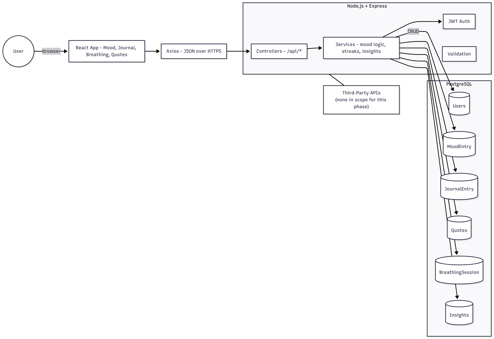
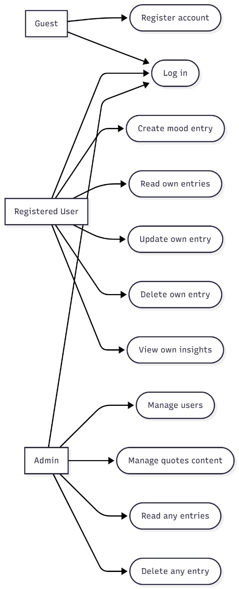
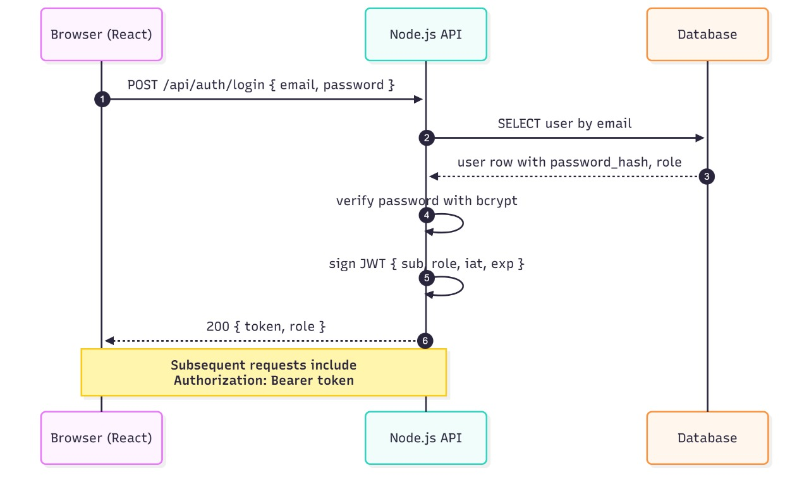

# MINDMATE - System Design (Part 3)

 **TEAM MEMBER:**
- Saunil Patel
- Rohit Saresa
- Fenny Patel

## Step 1: System Architecture Overview

### Architecture style (3-tier):

- Presentation: React SPA

- Application: Node.js with Express (controllers + simple services)

- Data: MySQL 

### System Architecture Diagram: 

## Step 2: Technology Stack
### Front end

- React 18 with Vite for fast dev builds

- React Router for client-side navigation

- Axios for HTTP requests

- Tailwind CSS for utility-first styling

### Back end

- Node.js 20

- Express 4

- Prisma ORM for type-safe data access

### Database

- MySql

### Authentication

- JWT access and refresh tokens

- Password hashing with bcrypt

- Short-lived access tokens, longer-lived refresh tokens stored httpOnly

### Other toolings

- Testing with Jest and Supertest

- Containerization with Docker

- Deployment on AWS (ECS or Elastic Beanstalk)

- CI via GitHub Actions

## Step 3: Authentication & Role-Based Access Control

This app keeps things simple: three roles and a handful of guarded actions. Guests can browse and sign up, registered users manage their own data, and admins have full control for support and moderation.

### Roles
- *Guest*
- *Registered User*
- *Admin*

### Permissions for key actions

| Action                | Guest | Registered User     | Admin        |
|-----------------------|:-----:|:-------------------:|:------------:|
| Register account      | Allow | N/A                 | Allow        |
| Log in                | Allow | Allow               | Allow        |
| Create mood entry     | Deny  | Allow (own)         | Allow (any)  |
| Read mood entries     | Deny  | Allow (own)         | Allow (any)  |
| Update mood entry     | Deny  | Allow (own)         | Allow (any)  |
| Delete mood entry     | Deny  | Allow (own)         | Allow (any)  |

## Authentication Flow

### Registration & Login
- Users register using *email and password* through the front end.
- Credentials are verified on login via the *Node.js / Express API*.
- Passwords are *hashed with bcrypt* before being stored securely in the database.

### Session Management
- After successful login, the server issues a *JWT (JSON Web Token)*.
- Each token contains the user’s *ID and role* and is stored in *HTTP-only cookies* for added security.
- Tokens are sent automatically with each request, allowing the server to verify user identity without exposing credentials.

### Role-Based Access Enforcement
- Middleware checks the *JWT* on every protected request.
- The user’s *role* is verified before granting access to restricted routes (for example, /api/admin/*).
- Unauthorized users receive a *403 Forbidden* response, keeping sensitive endpoints protected.

## Step 4: UML & Architecture Diagrams
-UML Diagram

-Sequence Diagram

-System Architecture Diagram

## Step 5: API: Auth and Resources

### Auth

POST /api/auth/register  
Role: Guest  
Request:
{ "name": "Ava", "email": "ava@x.com", "password": "Secret123" }  
Response:
{ "token": "jwt", "user": { "id": 1, "name": "Ava", "role": "USER" } }

POST /api/auth/login  
Role: Guest  
Request:
{ "email": "ava@x.com", "password": "Secret123" }  
Response:
{ "token": "jwt", "user": { "id": 1, "name": "Ava", "role": "USER" } }

POST /api/auth/logout  
Role: User, Admin  
Request:
{}  
Response:
{ "ok": true }

---

### Users

GET /api/users/me  
Role: User, Admin  
Response:
{ "id": 1, "name": "Ava", "email": "ava@x.com", "role": "USER" }

GET /api/users  
Role: Admin  
Query: ?page=1&limit=20  
Response:
[ { "id": 1, "name": "Ava", "role": "USER" } ]

PATCH /api/users/:id/role  
Role: Admin  
Request:
{ "role": "ADMIN" }  
Response:
{ "id": 7, "name": "Bob", "role": "ADMIN" }

---

### Mood entries

POST /api/moods  
Role: User, Admin  
Request:
{ "value": 4, "note": "calm", "timestamp": "2025-10-20T14:30:00Z" }  
Response:
{ "id": 101, "user_id": 1, "value": 4, "note": "calm", "created_at": "..." }

GET /api/moods  
Role: User, Admin  
Behavior: User sees own. Admin can pass ?user_id=...  
Query: ?from=2025-10-01&to=2025-10-20&page=1&limit=50  
Response:
[ { "id": 101, "value": 4, "note": "calm", "created_at": "..." } ]

PATCH /api/moods/:id  
Role: User (own), Admin (any)  
Request:
{ "value": 5, "note": "better" }  
Response:
{ "id": 101, "value": 5, "note": "better", "updated_at": "..." }

DELETE /api/moods/:id  
Role: User (own), Admin (any)  
Response:
{ "ok": true }

---

### Journal entries

POST /api/journals  
Role: User, Admin  
Request:
{ "title": "Gratitude", "content": "Good walk", "timestamp": "2025-10-20T14:40:00Z" }  
Response:
{ "id": 55, "user_id": 1, "title": "Gratitude", "content": "Good walk", "created_at": "..." }

GET /api/journals  
Role: User, Admin  
Behavior: User sees own. Admin can query ?user_id=...  
Query: ?q=walk&page=1&limit=20  
Response:
[ { "id": 55, "title": "Gratitude", "created_at": "..." } ]

PATCH /api/journals/:id  
Role: User (own), Admin (any)  
Request:
{ "title": "Gratitude - Mon", "content": "..." }  
Response:
{ "id": 55, "title": "Gratitude - Mon", "updated_at": "..." }

DELETE /api/journals/:id  
Role: User (own), Admin (any)  
Response:
{ "ok": true }

---

### Quotes

GET /api/quotes/random  
Role: Guest, User, Admin  
Response:
{ "id": 9, "text": "Keep going.", "author": "Unknown" }

POST /api/quotes  
Role: Admin  
Request:
{ "text": "New quote", "author": "Author" }  
Response:
{ "id": 42, "text": "New quote", "author": "Author" }

DELETE /api/quotes/:id  
Role: Admin  
Response:
{ "ok": true }

---

### Breathing sessions

POST /api/breathing  
Role: User, Admin  
Request:
{ "type": "box", "duration_sec": 180, "completed": true, "timestamp": "2025-10-20T14:50:00Z" }  
Response:
{ "id": 77, "user_id": 1, "type": "box", "duration_sec": 180, "completed": true }

GET /api/breathing  
Role: User, Admin  
Behavior: User sees own. Admin can query ?user_id=...  
Response:
[ { "id": 77, "type": "box", "duration_sec": 180, "completed": true } ]

---

### Insights

GET /api/insights  
Role: User, Admin  
Behavior: User gets own derived stats. Admin can query ?user_id=...  
Response:
{
  "user_id": 1,
  "period": { "from": "2025-10-01", "to": "2025-10-20" },
  "mood": { "avg": 3.8, "best_day": "2025-10-12" },
  "breathing": { "sessions": 12 },
  "journals": { "entries": 7 }
}

### Step 6: Security and Performance Considerations

### Security

Our goal is to make the app both safe for users and resilient against common risks.

- *Use HTTPS everywhere:*  
  All traffic is served securely. The load balancer or host terminates TLS, and any HTTP request is automatically redirected to HTTPS.

- *Protect user credentials:*  
  Passwords are never stored as plain text. They’re hashed using *bcrypt* with around 10–12 rounds for strong protection.  
  Basic password rules (minimum length and complexity) are enforced during registration.

- *Follow good JWT practices:*  
  Tokens are short-lived and contain essential claims like sub, role, iat, and exp.  
  Each request verifies the token’s signature before granting access.  
  Secrets are rotated if there’s ever a risk of exposure.  
  (Refresh tokens may be introduced later for longer sessions.)

- *Validate and sanitize inputs:*  
  Every incoming request (body, params, query) is validated using *Zod* or *Joi*.  
  Unknown or extra fields are rejected, and any text shown back to users is sanitized to prevent cross-site scripting (XSS).

- *Role-based access (RBAC):*  
  Role checks happen on the server side through middleware and service logic.  
  The client may show or hide certain UI elements for convenience, but real access control always happens on the backend.

- *Prevent brute-force attempts:*  
  Authentication routes have built-in rate limiting.  
  If repeated login failures occur, the app applies short lockouts or incremental backoff to protect user accounts.

---

### Performance

Alongside security, the system is tuned for efficiency so it stays responsive as data grows.

- *Database optimization:*  
  Indexes are added on high-traffic columns like user_id and created_at in mood, journal, and breathing tables.  
  Slow queries are analyzed with EXPLAIN to fine-tune performance.

- *Smart pagination and filtering:*  
  All list endpoints use page and limit parameters, plus optional date filters.  
  This prevents large payloads and keeps the client fast.

- *Efficient connections and responses:*  
  A PostgreSQL connection pool manages concurrent requests efficiently.  
  API responses are compressed with *gzip* or *brotli*, which cuts down network usage and speeds up load times.

---
